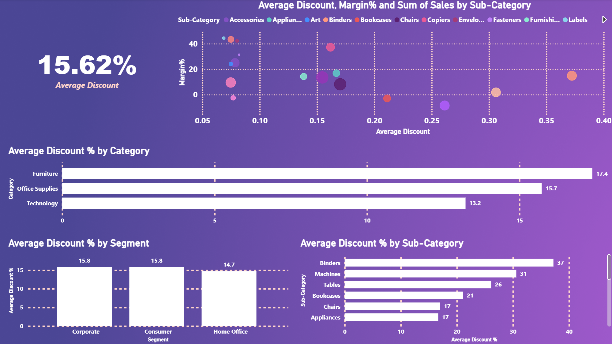

# superstore-sales-analysis
Analysis of products sales in stores

## 📊 Project Overview

This Power BI dashboard analyzes retail sales performance across multiple US regions to provide actionable business insights. The project transforms ~10,000 transaction records into a comprehensive 4-page analysis covering:
- **Executive Overview:** Overall business performance and category distribution
- **Geographic Analysis:** Regional strengths and city-level opportunities  
- **Product Deep Dive:** Sub-category profitability and sales patterns
- **Discount Impact:** The relationship between discount strategies and profit margins

The interactive visualizations enable data-driven decision-making for inventory, pricing, and regional investment strategies.

## 🎯 Business Objectives

This analysis addresses the following key business questions:

1. **What drives overall sales and profitability?** 
   Which categories, regions, and products contribute most to revenue and profit margins?

2. **How does geographic location impact performance?** 
   Which regions and cities represent the strongest markets vs. underperforming areas?

3. **What insights emerge at the sub-category level?** 
   Beyond broad categories, which specific product lines are stars vs. loss-makers?

4. **How do discount strategies affect profitability?** 
   Is heavy discounting the root cause of low margins, or are there other structural factors?

5. **Where should the business prioritize investments?** 
   Which product-region combinations offer the highest growth potential vs. requiring intervention?

## 🛠️ Tools & Technologies

- **Data Source:** Kaggle - Sample Superstore Dataset
- **Data Cleaning & Preparation:** Microsoft Excel
- **Data Analysis & Visualization:** Microsoft Power BI Desktop
- **Key Techniques:** 
  - DAX measures for KPI calculations
  - Interactive slicers and filters
  - Cross-tabulation analysis
  - Scatter plot correlation analysis
 
## 📁 Dataset Information

- **Source:** Kaggle - Sample Superstore Dataset
- **Records:** 9,993 transactions
- **Geographic Scope:** United States (4 regions, multiple cities)
- **Business Type:** Retail superstore chain
- **Key Fields:**
  - **Sales Metrics:** Sales, Profit, Quantity, Discount
  - **Product Data:** Category, Sub-Category
  - **Customer Data:** Segment (Consumer, Corporate, Home Office)
  - **Geographic Data:** Region, State, City, Postal Code
  - **Operational Data:** Ship Mode
 
## 📈 Dashboard Pages

### Page 1: Executive Overview

**Key Insights:**
- **Solid financial performance:** $2.30M in sales with $286K profit (12% margin) - healthy for retail industry
- **Technology dominates revenue** but Furniture shows problematic low profitability despite strong sales
- **Geographic concentration:** West and East regions drive majority of performance; South significantly underperforms
- **Sales-profit disconnect:** High revenue doesn't guarantee high profit - Office Supplies outperforms Furniture in margins despite lower sales

**Business Impact:** Identifies need for urgent Furniture category review and regional strategy refinement.

---

### Page 2: Geographic & Customer Analysis  

**Key Insights:**
- **Top performers:** Yonkers leads in both sales ($7,658) and profit ($2,768); Wilmington shows strong efficiency
- **Problem markets:** York and Yuma generate negative profits despite reasonable sales - require immediate investigation
- **Woonsocket anomaly:** Exceptional 32% profit margin (vs. 12% company average) - success model to replicate
- **Product profitability spectrum:** Phones are volume leaders but Tables drive significant losses; high discount doesn't guarantee failure (Binders prove this)

**Business Impact:** Pinpoints specific cities for expansion vs. intervention; identifies replicable high-margin strategies.

---

### Page 3: Product Deep Dive

**Key Insights:**
- **Hidden profit engines:** Labels (44% margin) and Paper (43% margin) drive profitability despite low visibility
- **Phones paradox:** Highest sales but only 13% margin - essential volume driver, not profit source
- **Furniture root cause confirmed:** Tables and Bookcases show negative margins, dragging entire category down
- **Regional patterns:** Central region struggles across all categories (especially Furniture: -$2,871 loss); West/East consistent performers

**Business Impact:** Enables surgical approach to Furniture (fix specific sub-categories, not entire category); identifies Central region operational issues.

---

### Page 4: Discount & Profitability Analysis

**Key Insights:**
- **Average discount of 15.62%** is sustainable and not the primary profitability killer
- **Discount paradox:** Binders succeed with 37% discount while Tables fail at 20% - product economics matter more than discount level
- **Category patterns:** Furniture's 17.4% discount attempts to compensate for structural cost issues (high logistics, long purchase cycles)
- **Root cause revealed:** Poor unit economics and cost structure, not discounting, drive low margins in problem products

**Business Impact:** Shifts focus from blanket discount reduction to fixing underlying cost structures and product-market fit issues.

## 🔍 Key Findings Summary

### Overall Business Performance
1. **Healthy but uneven profitability:** Company achieves solid 12% profit margin on $2.30M sales, but performance varies dramatically across products and regions - some areas generate 30%+ margins while others operate at losses.

### Product Insights  
2. **Small supplies are profit engines:** Low-visibility items like Labels (44% margin), Paper (43%), and Envelopes (42%) drive profitability despite minimal sales volumes - these are the hidden stars.

3. **Furniture category crisis identified:** Tables and Bookcases generate significant losses, dragging down entire Furniture category - root cause is structural (high costs, low turnover) not just discounting.

4. **Volume vs. value trade-off:** Phones lead sales with highest volume but deliver only 13% margins; demonstrates successful mass-market strategy where thin margins are compensated by scale.

### Geographic Patterns
5. **Regional performance divide:** West and East regions consistently strong across all categories; Central shows systematic underperformance (all categories struggle); South mixed results.

6. **Central region structural problems:** Furniture loses $2,871 in Central alone - suggests operational issues (logistics costs, local competition) rather than product problems.

### Strategic Insights
7. **Discount is symptom, not disease:** Analysis proves high discounts don't kill margins - Binders thrive at 37% discount while Tables fail at 20%. Poor unit economics (costs, pricing, product-market fit) are the real profitability killers.

## 💡 Business Recommendations

### Immediate Actions (0-3 months)
1. **Tables & Bookcases intervention:** Conduct urgent profitability review - options include aggressive cost reduction, pricing restructuring, or discontinuation. Current losses are unsustainable, especially in Central region.

2. **Central region task force:** Form cross-functional team to diagnose Central's systematic underperformance across all categories. Investigate logistics costs, supplier relationships, and competitive dynamics. Decision point: fix within 6 months or reduce footprint.

3. **Replicate Woonsocket success:** Study this market's 32% margin (vs. 12% company average) - identify product mix, customer segments, and operational approaches that can be scaled to similar demographics.

### Strategic Initiatives (3-12 months)
4. **Portfolio rebalancing toward high-margin products:** Increase marketing investment in Labels, Paper, and Copiers (40%+ margins). Maintain Phones for volume/market presence but don't expect margin expansion.

5. **Regional resource reallocation:** Double down on proven West/East markets. Shift Central region focus to Technology (least-bad performer there) while addressing operational issues. Investigate South's Technology weakness (only 4.4% margin).

6. **Surgical approach to Furniture:** Don't abandon entire category - Chairs perform acceptably. Focus on proven winners and restructure/eliminate problem sub-categories (Tables, Bookcases).

### Key Principle
**Shift from "maximize sales" to "maximize profitable sales"** - this analysis definitively proves high revenue doesn't equal high profit. Prioritize margin improvement over volume growth in strategic planning.

## 🎛️ Interactive Features

- **Dynamic filtering:** Category, Segment, and Region slicers enable users to drill down into specific business areas
- **Cross-page consistency:** Filters apply across all pages for seamless exploration
- **Hover tooltips:** Additional context available on charts (e.g., sub-category details, exact values)
- **Comparative analysis:** Multiple chart types (scatter plots, treemaps, matrices) reveal patterns not visible in single dimensions

## 📂 Repository Contents

superstore-sales-analysis/
├── README.md
├── Superstore_Dashboard.pbix
├── screenshots/
│   ├── page1_executive_overview.png
│   ├── page2_geographic_analysis.png
│   ├── page3_product_deep_dive.png
│   └── page4_discount_analysis.png
└── data/
    └── superstore_data.csv

## 👤 Author

**Thi Kim Tam Nguyen**

Data Analyst | Fresh Graduate

📧 [thikimtamnguyen151@gmail.com] | 💼 [LinkedIn](https://www.linkedin.com/in/kim-tam-nguyen-9ba907135/)

---

*This project was created for portfolio demonstration purposes.*
